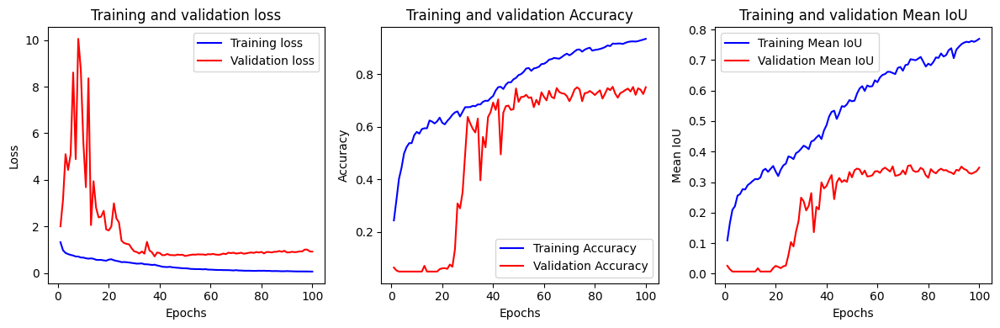

# satellite-segmentation

We take satellite images and perform multi-class segmentation. In particular, we distinguish between 7 different classes:

- (0) unlabeled
- (1) dense forest
- (2) sparse forest
- (3) moor
- (4) herbaceous formation
- (5) building
- (6) road

Initially, the maps have dimension 1000x1000 pixels and come with their own annotated mask.

## Data pre-processing

Due to memory constraints, we resized the maps and their masks to 128x128 pixel size. During experiments different strategies such as subpatching or resize-subpatch have been tried, but lead to worse results. In general, we want to keep the spatial contex of the regions intact and not have a too zoomed view. No further domain-specific operations have been deployed on data.

## Model

The model used is MultiResUNet, a well-known architecture heavily inspired by the original U-Net. This architecture features the two novel blocks as described in the orginal paper: MultiRes blocks and Res Path. For futher details, you can find the original paper in the 'docs' folder. You can also find the implementation plus detailed description of the model directly in the Jupiter notebook.

## Results

After intense training, we notice that after epoch 40 we do not have any further improvements. As a metric of performance we used MeanIoU, Accuracy and the Dice coefficient. On the test set, we reached an impressive Dice coefficient of 0.515.

## Usage

All the code, comments and tests are inside 'demo.ipynb'. To use it, import it in an enviroment such as Colab or Kaggle.

